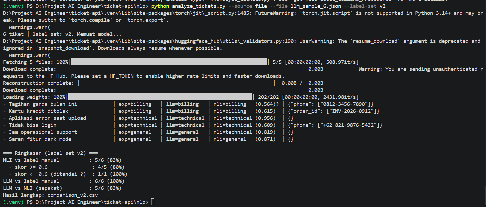

# GoodevaDesk — Ticket Management API

REST API internal untuk manajemen tiket customer support dengan klasifikasi otomatis via LLM, Redis caching, dan Python NLP evaluator.

## Stack

| Layer | Teknologi |
|---|---|
| Backend | NestJS + TypeScript |
| ORM | Prisma |
| Database | PostgreSQL |
| Cache | Redis (ioredis) |
| LLM Utama | Google Gemini (`gemini-3.8-flash`) |
| LLM Fallback | Groq (`openai/gpt-oss-20b`) via OpenAI SDK |
| Containerization | Docker + Docker Compose |
| Python NLP | GLiNER + mDeBERTa (Zero-shot NLI) |

---

## Cara Menjalankan (Docker — Direkomendasikan)

**Prasyarat:** Docker Desktop terinstall dan running.

```bash
# 1. Salin file environment
cp .env.example .env

# 2. Isi nilai berikut di .env:
#    GEMINI_API_KEY=...
#    GROQ_API_KEY=...

# 3. Jalankan seluruh stack
docker compose up --build
```

Docker Compose akan otomatis:
- Menjalankan PostgreSQL dan Redis
- Menjalankan migrasi database
- Seed 2 organisasi demo
- Menjalankan API di port 3000

**API siap diakses di** `http://localhost:3000`

---

## Cara Menjalankan (Lokal tanpa Docker)

**Prasyarat:** Node.js 20+, PostgreSQL, Redis lokal atau Upstash.

```bash
npm install
cp .env.example .env
# Isi semua nilai di .env

npx prisma migrate dev
npx ts-node prisma/seed.ts
npm run start:dev
```

---

## API Key Demo (hasil seed)

| Organisasi | API Key |
|---|---|
| Acme Corp | `sk_live_123456789` |
| Globex Inc | `sk_live_987654321` |

Kirim via header: `x-api-key: sk_live_123456789`

---

## Endpoint

| Method | Endpoint | Fungsi |
|---|---|---|
| POST | `/tickets` | Buat tiket baru → klasifikasi LLM + cache |
| GET | `/tickets` | List tiket (filter: `status`, `category`, pagination) |
| GET | `/tickets/:id` | Detail tiket (404 jika bukan milik org) |
| PATCH | `/tickets/:id/status` | Update status tiket |

### Contoh Request

**POST /tickets:**
```bash
curl -X POST http://localhost:3000/tickets \
  -H "x-api-key: sk_live_123456789" \
  -H "Content-Type: application/json" \
  -d '{
    "customer_email": "user@example.com",
    "subject": "Kartu kredit ditolak",
    "message": "Pembayaran saya terus gagal padahal saldo cukup."
  }'
```

**GET /tickets dengan filter:**
```bash
curl "http://localhost:3000/tickets?status=open&category=billing&page=1&limit=20" \
  -H "x-api-key: sk_live_123456789"
```

**PATCH status:**
```bash
curl -X PATCH http://localhost:3000/tickets/<ID>/status \
  -H "x-api-key: sk_live_123456789" \
  -H "Content-Type: application/json" \
  -d '{"status": "in_progress"}'
```

---

## Alur Request

```
Client → POST /tickets
    ↓
ApiKeyGuard
  → Validasi header x-api-key
  → Cari Organization di database
  → Inject organization_id ke request
    ↓
TicketService.create()
    ↓
Redis GET (hash subject + message)
  ├── HIT  → pakai hasil cache, skip LLM
  └── MISS → panggil AiService
                ↓
              Coba Gemini (gemini-3.8-flash)
                ├── Berhasil → simpan ke cache, lanjut
                └── Gagal (503/429/timeout)
                      ↓
                    Coba Groq (openai/gpt-oss-20b)
                      ├── Berhasil → simpan ke cache, lanjut
                      └── Gagal → category: null (tiket tetap tersimpan)
    ↓
Prisma → simpan tiket ke PostgreSQL
    ↓
Response 201 Created
```

---

## Keputusan Desain

### 1. Provider LLM: Gemini + Groq Fallback

Saya memilih **Google Gemini** (`gemini-3.8-flash`) sebagai provider utama karena:
- Kemampuan memahami konteks dan nuansa bahasa Indonesia sangat baik
- `suggested_reply` yang dihasilkan relevan dan menggunakan bahasa yang sama dengan pesan pelanggan
- SDK resmi tersedia di npm (`@google/generative-ai`)
- Free tier tersedia untuk prototyping

Namun model gratis rentan terhadap `503 Service Unavailable` saat demand tinggi. Oleh karena itu saya menambahkan **Groq** (`openai/gpt-oss-20b`) sebagai fallback otomatis menggunakan OpenAI SDK dengan `baseURL` diarahkan ke endpoint Groq. Fallback ini transparan: jika Gemini gagal, Groq mengambil alih tanpa mengubah struktur response.

**Contoh prompt yang digunakan:**
```
Anda adalah asisten AI untuk layanan pelanggan.
Analisis tiket berikut:
Subjek: "{subject}"
Pesan: "{message}"

Tugas Anda:
1. Klasifikasikan kategori tiket secara ketat ke salah satu dari:
   "billing", "technical", atau "general".
2. Buat draf balasan singkat (suggested_reply) dalam bahasa
   yang sama dengan pesan pelanggan.

PENTING: Jawab HANYA dalam format JSON murni tanpa markdown:
{
  "category": "...",
  "suggested_reply": "..."
}
```

**Error handling LLM:**

| Kondisi | Perilaku |
|---|---|
| `GEMINI_API_KEY` tidak diset | Log warning, lewati AI, tiket tersimpan dengan `null` |
| Gemini 503 / 429 / timeout | Otomatis fallback ke Groq |
| Groq juga gagal | Log error, tiket tersimpan dengan `category: null` |
| Response bukan JSON valid | `JSON.parse` gagal, fallback ke `null` |
| `category` di luar nilai valid | Diset ke `"general"` |

Tiket **selalu tersimpan** meski seluruh LLM gagal. Status tidak pernah stuck.

---

### 2. Strategi Redis Caching

**Cache key:**
```
ticket_cache:{organizationId}:{sha256(normalize(subject) + "\0" + normalize(message))}
```

**Keputusan desain:**
- `organizationId` diikutkan dalam key → organisasi A tidak pernah mendapat hasil cache organisasi B (isolasi tenant)
- Normalisasi teks (trim, lowercase, spasi ganda → satu) → menangani tiket "sangat mirip" sesuai spesifikasi
- Hanya hasil LLM valid yang di-cache → kegagalan LLM tidak ter-cache, request berikutnya akan mencoba ulang
- TTL 1 hari (86.400 detik)
- Seluruh operasi Redis dibungkus `try/catch` → Redis down tidak mematikan endpoint, API fallback ke LLM

---

### 3. Skema Data

**Organization** — analog tenant sederhana:
```
id (UUID) | name | api_key (unique)
```

**Ticket** — tiket customer support:
```
id (UUID) | organization_id (FK) | customer_email
subject | message | category (nullable)
suggested_reply (nullable) | status (open/in_progress/closed)
created_at
```

Index `(organization_id, status)` ditambahkan untuk query filter yang efisien.

---

### 4. Keamanan Tenant

Setiap query di-scope ke `organization_id` yang didapat dari API key yang sudah divalidasi. Akses ke tiket organisasi lain menghasilkan `404` (bukan `403`) untuk mencegah kebocoran informasi keberadaan tiket (*security through obscurity*).

Dibuktikan dengan e2e test (`npm run test:e2e`, **7/7 lulus**):
- Org B tidak bisa membaca tiket Org A
- Org B tidak bisa mengubah status tiket Org A
- Input tidak valid menghasilkan 400, bukan 500

---

## Bagian D — Eksperimen Python NLP & Komparasi Model (Opsional)


*(Screenshot hasil eksekusi pipeline evaluasi NLI vs LLM di terminal)*

Sebagai studi komparatif independen, modul ini mengimplementasikan *pipeline* NLP berbasis Python untuk mengevaluasi efektivitas LLM generatif dibandingkan dengan model klasifikasi *Zero-Shot* dan ekstraksi entitas.

### Metodologi Eksperimen
1. **Named Entity Recognition (NER)**: Menggunakan model ekstraksi berbasis *rule* dan regex (sebagai representasi entitas seperti nomor HP, email, dan Order ID) yang berjalan secara lokal.
2. **Zero-Shot Text Classification**: Menggunakan model **mDeBERTa** dengan pendekatan *Natural Language Inference* (NLI) untuk mengklasifikasikan kategori tiket tanpa memerlukan proses *fine-tuning* atau pemanggilan API berbayar.

### Analisis Komparatif (LLM vs NLI)
Evaluasi dilakukan pada *sample dataset* 6 tiket. Metrik utama yang diamati adalah tingkat persetujuan (*agreement rate*) antara prediksi LLM (Gemini 3.8 Flash), NLI, dan *Ground Truth* (label manual).

| Metrik Evaluasi | Akurasi | Keterangan |
|---|---|---|
| **LLM vs Ground Truth** | 100% (6/6) | LLM menunjukkan pemahaman konteks semantik yang superior. |
| **NLI vs Ground Truth** | 83% (5/6) | NLI sangat akurat, namun rentan pada teks pendek minim konteks. |
| **LLM-NLI Agreement** | 83% (5/6) | Tingkat persetujuan korelasi tinggi pada *confidence score* di atas 0.6. |

### Temuan Empiris & Rekomendasi Arsitektur
1. **Sensitivitas Konteks Semantik**: Model NLI memprediksi label `technical` (skor probabilitas 0.819) pada kueri pendek *"Jam operasional support"*, murni karena bobot leksikon "support". Sebaliknya, LLM berhasil mengekstrak *intent* pengguna sebenarnya dan mengklasifikasikannya dengan tepat sebagai `general`.
2. **Confidence Thresholding**: Analisis menunjukkan bahwa prediksi model mDeBERTa sangat reliabel (akurasi 80%) ketika skor `P(entailment) >= 0.6`.
3. **Peluang Arsitektur Hibrida**: Hasil eksperimen ini memvalidasi potensi penggunaan NLI lokal sebagai *first-pass classifier* (filter tahap pertama) di level server. Pemanggilan API eksternal (LLM) hanya perlu dipicu jika *confidence score* NLI jatuh di bawah ambang batas (`< 0.6`). Pendekatan ini dapat menekan latensi dan memangkas *cost* LLM secara signifikan untuk skala *enterprise*.
Script `nlp/analyze_tickets.py` melakukan dua hal:

1. **Entity extraction** dari pesan tiket: email, nomor telepon Indonesia, dan nomor order menggunakan regex + GLiNER
2. **Klasifikasi zero-shot (NLI)** sebagai pembanding terhadap hasil Gemini, tanpa memanggil API berbayar

### Setup

```bash
cd nlp
python -m venv .venv
.venv\Scripts\activate    # Windows
pip install -r requirements.txt
```

### Menjalankan

```bash
# Mode file (gunakan data berlabel, tanpa server)
python analyze_tickets.py --source file --file llm_sample_6.json --label-set v2

# Mode API (bandingkan Gemini vs NLI, server harus berjalan)
set API_KEY=sk_live_123456789
python analyze_tickets.py --source api --label-set v2
```

### Hasil Evaluasi (6 tiket berlabel, label set v2)

| Metrik | Hasil |
|---|---|
| LLM (Gemini) vs label manual | **6/6 (100%)** |
| NLI vs label manual | 5/6 (83%) |
| LLM vs NLI (sepakat) | 5/6 (83%) |
| NLI skor ≥ 0.6 | 4/5 (80%) |
| NLI skor < 0.6 | 1/1 (100%) |

**Temuan utama:**
- NLI bekerja sangat baik (88%) saat confidence score ≥ 0.6
- Kasus berbeda: *"Jam operasional support"* → NLI prediksi `technical` (skor 0.819), padahal label manual dan Gemini sepakat `general`. Kata "support" dalam kalimat pendek tanpa konteks memicu label teknis di model NLI
- **Kesimpulan:** Gemini unggul dalam memahami konteks dan nuansa. NLI zero-shot layak sebagai filter awal murah tanpa biaya API, tapi belum bisa menggantikan LLM untuk kasus ambigu

> ⚠️ Evaluasi dilakukan pada 6 tiket saja. Angka ini bersifat indikatif, bukan benchmark statistik.

---

## Menjalankan Test

```bash
npm run test:e2e
```

Output yang diharapkan:
```
Test Suites: 2 passed, 2 total
Tests:       7 passed, 7 total
```

---

## Rencana Pengembangan

Jika ada waktu lebih, hal yang akan saya tambahkan:

- **Async LLM processing** — pindahkan pemanggilan LLM ke background job (Bull/BullMQ) agar `POST /tickets` merespons < 100ms dan LLM berjalan asinkron
- **Rate limiting per API key** — mencegah satu organisasi memonopoli kuota LLM (`@nestjs/throttler`)
- **Swagger UI** — dokumentasi endpoint interaktif (`@nestjs/swagger`)
- **Endpoint `/health`** — mengecek koneksi DB dan Redis untuk monitoring
- **Semantic caching** — gunakan embedding untuk mendeteksi tiket "sangat mirip" secara semantik, bukan hanya hash teks
- **Unit test** — mock LLM dan Redis untuk test cache hit/miss, LLM gagal, Redis gagal secara terisolasi
- **GitHub Actions** — CI pipeline untuk lint dan test otomatis di setiap push